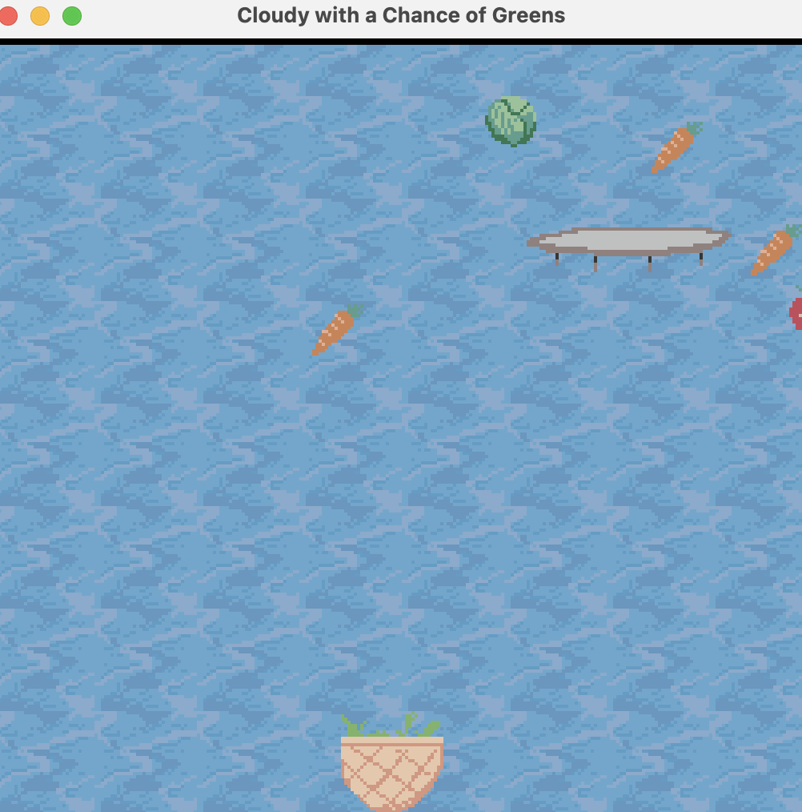
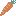
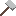
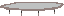
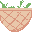

# Cloudy With a Chance of Greens
<!---
and strawberries too I guess
-->
Author: Flora Cheng

Design: So in addition to the typical catching fruit/food/items that fall from the sky game, this game has more realistic gravity and also includes the addition of trampolines, which may or may not help with your catching ability! In addition to the general items to catch, there's also a special item to help move the trampoline to more advantagous positions, how exciting! 

Screen Shot:

How Your Asset Pipeline Works:

1. Image assets are added to the directory
2. Image files are loaded in by the script through the load png function
3. Iterate through the output from the load png function to find the colors used in the image -- only the first 4 colors will be recorded to the pallete
4. Then iterate through the png's data by 8x8 chunks
5. Create a tile based off of each each chunk, by iterating through the chunk by row and then column to find the corresponding index to the pallete and update the 0bit and 1bit
6. Save the tile and pallete indicies for each png for future reference

Source Files:

Falling Objects
- [strawberry](data/strawberry.png)

- [cabbage](data/cabbage.png)

- [carrot](data/carrot.png)

- [hammer](data/hammer.png)

[trampoline](data/trampoline.png)

[basket](data/basket.png)

[background](data/background.png)

How To Play:

Use left and right arrows to move the basket and catch the falling foods. Catch the hammer and the trampoline will follow the basket for a short period of time! Note items will bounce if they land on the trampoline!

This game was built with [NEST](NEST.md).

